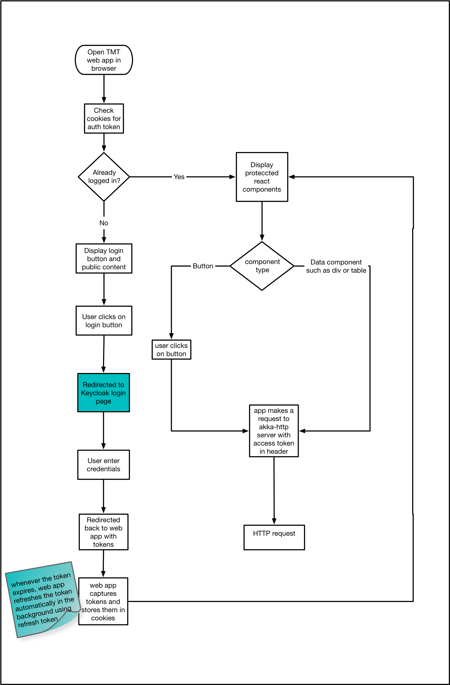

# csw-aas-js - Javascript adapter

csw-aas-js is a npm package which exposes react components to enable authentication and authorization.
csw-aas-js is built in typescript on top of [keycloak-js](https://www.keycloak.org/docs/latest/securing_apps/index.html#_javascript_adapter)
which is javascript adapter provided by keycloak.

## csw-aas-js Implementation

Core implementation of csw-aas-js uses

- [keycloak-js](https://www.keycloak.org/docs/latest/securing_apps/index.html#_javascript_adapter) - keycloak javascript adapter
- [React](https://reactjs.org/) - JavaScript library for building user interfaces
- [Typescript](https://www.typescriptlang.org/) - Types superset of JavaScript which compiles to JavaScript
- @extref[csw-location-service](csw:services/location) - resolve keycloak using location service http endpoint

## Project setup

`csw-aas-js` is a library written in [Typescript](https://www.typescriptlang.org/). `tsc` is a command line compiler of
Typescript which compiles typescrit files to JavaScript. `tsc` picks up configurations from `tsconfig.json` file which
is at root level of project. `tsconfig.json` allows to configure multiple compiler options. Please refer
[this](https://www.typescriptlang.org/docs/handbook/compiler-options.html) for details of compiler options.
`npm run build` command will run `tsc` which will produce outputs (.js and .d.ts). `.d.ts` files are the type declaration files
which provide typings for react components exported by library. `package.json` points to `index.ts` as a entry point for library
and `index.d.ts` as types. This will help `csw-aas-js` library users to know type signatures of components. e.g. type
signature for react component props, api signatures. `csw-aas-js` can be seamlessly consumed by applications written ES6
or Typescript.

## Keycloak

In order for web application utilize keycloak following steps are needed:

- Registered web application as a public keycloak client
Please refer to [keycloak documentation](https://www.keycloak.org/docs/latest/getting_started/index.html)
for details.

- Create new Keycloak client instance
This instantiation expects config which includes keycloak server url and some application
specific config like `realm` and `clientId`. csw-aas-js uses csw location service to resolve keycloak server. If you
don't want to use location service, you can provide `AAS-server-url` along with `realm` and `clientId` in web application config.

```javascript
const AppConfig = {
  realm: 'example',
  clientId: 'example-app'
}
```
- Initialize javascript adapter
To call secure end point, web application first needs to be authenticated using keycloak server. There are two options to make this adapter automatically authenticate - `login-required` and `check-sso`.
`login-required` will automatically authenticate if the user is already logged-in, otherwise it will display keycloak login page.
`check-sso` will only authenticate if the user is already logged-in. If the user is not logged-in the browser will be redirected back to
the application and remain unauthenticated.

csw-aas-js use `check-sso` to instantiate keycloak. It shows secure components if user is already logged in.
If user is not authenticated Login component is rendered. If user clicks on login button it instantiates keyclock use `login-required`. This redirects
user to keycloak login page. As access token has very short life span, at time of keycloak instantiation csw-aas-js also adds hooks to refresh
token. This gives seamless user experience as user need not to login again.

Keycloak adapter supports three authorization flows e.g. authorization code flow, implicit flow and hybrid flow.
csw-aas-js has chosen hybrid flow as it has better performance than authorization code flow and unlike implicit flow,
hybrid flow makes refresh token available to application. For more information please refer [keyclok documentaion for authorization flows](https://www.keycloak.org/docs/latest/securing_apps/index.html#_javascript_implicit_flow)

## Working of csw-aas-js

When user opens web application in browser, AuthContextProvider component is mounted. Which does instantiation of keycloak
client and initialize keycloak javascript adapter with `check-sso` and `hybrid` authorization flow. It also creates hooks for refreshing token when
token is expired which silently refresh token resulting seamless user experience once logged in. After authentication is done via
keycloak javascript adapter, AuthContext is extracted in domain model and this data is passed down the component tree using
react context api. AuthContext gives handle to token, realm and resource roles, userInfo. Any component which want to use
this information can become consumer of AuthContext. For example

Javascript
:   @@snip [use auth context](../../../../example/src/components/config/CreateConfig.tsx) { #use-auth-context }

Access token can be extracted from `auth` and it can be sent in `Authorization` header for calling secure api

For example -

```javascript
const SampleComponent = () => {

    const url = 'http://localhost:8080/secure-restful-service';
    const auth = useContext(AuthContext) //AuthContext from csw-aas-js

    const req = new XMLHttpRequest();
    req.open('GET', url, true);
    req.setRequestHeader('Accept', 'application/json');

    //extract token from auth context and set Authorization header
    req.setRequestHeader('Authorization', 'Bearer ' + auth.token);

    req.onreadystatechange = function () {
        if (req.readyState == 4) {
            if (req.status == 200) {
                alert('Success');
            } else if (req.status == 403) {
                alert('Forbidden');
            }
        }
    }

    req.send();
};
```

Following diagram explains javascript application flow for making request to secure http api



When user opens web application in browser, csw-aas-js checks if user is already logged in using `check-sso` mode. If user is
not logged in then `Login` button is shown. When user clicks on login, user will be redirected to keyclok login page.
This completes authentication process. Once authentication is done, `AuthContextProvider` extract `AuthContext` domain model and
make it available to consumers of AuthContext. Protected react components can be shown based on information in `AuthContext`.
For example, CreateConfig component can be shown only to users having `config admin` role. After the user is authenticated
the application can make requests to RESTful services secured by Keycloak by including the bearer token in the Authorization header.
This completed workflow for web application calling secure http endpoint.
