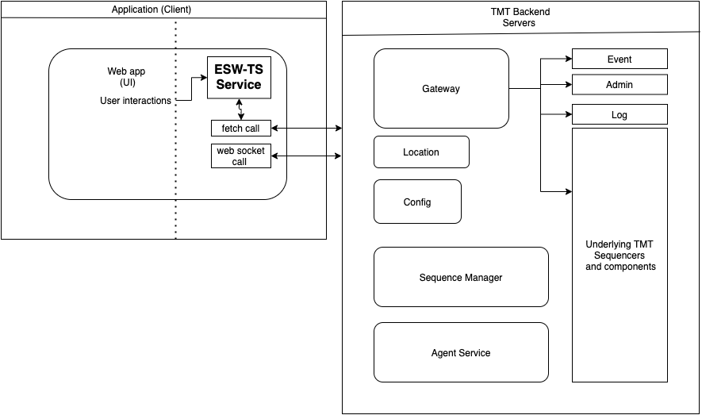

# Technical Design Documentation

@@@ index
 - [Agent service](../services/agent-service/agent-service.md)
 - [Sequence Manager service](../services/sequence-manager/sequence-manager-service.md)
 - [AAS](csw-aas-js.md)

@@@

## Architectural overview

Following diagram explains UI application flow for making request to TMT backend component and explains where does the ESW-TS service fit in the TMT architecture.

For example:
A web app specifically created for sending control command to a HCD component.
    1. User clicks on submit button.
    2. Command Service of ESW-TS creates appropriate payload adhering to @extref[service contract](esw:commons/contracts.html) exposed by GatewayServer
    3. esw-ts uses fetch api of browser to make request.
    4. Gateway Server on receiving correct payload, process it and sends the Control command to the destined HCD component.
    5. On successfully handling of command by HCD component, GatewayServer returns a SuccessResponse.
    6. esw-ts handles the response and returns it, as it was received to the caller web-ui component.

